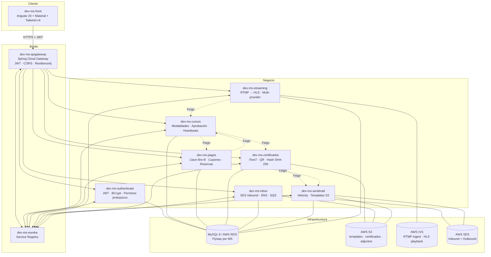

<div align="center">

# Eduessence

### Una plataforma de educación médica continua, contada en 10 microservicios.

*Cursos, cumbres, streaming en vivo, certificados con QR verificable, pagos manuales con llave Bre-B, bandeja corporativa sobre SES Inbound — todo orquestado por un gateway, descubierto por Eureka y servido a un front Angular 20.*

<br />


</div>

---

## Por qué este repo merece tu scroll

Este monorepo es la **reescritura completa** de un sistema histórico en PHP (vivía en `C:\xampp\htdocs`) hacia una arquitectura moderna basada en **Spring Cloud + Angular 20**. La meta no fue traducir línea por línea — fue **rediseñar el dominio** para que escale:

- Un curso ya no es "un row con un PDF": ahora tiene **N modalidades** (presencial, virtual en vivo, grabado), **secciones bloqueantes**, lecciones tipadas (video, examen, actividad, sesión virtual), y un motor de aprobación parametrizable con **4 criterios independientes**.
- Un certificado ya no se imprime a mano: se **renderiza con iText7** sobre un template parametrizable en S3, se le incrusta un **QR ZXing**, se firma con **SHA-256** y se entrega vía **URL pre-firmada**.
- Una transmisión en vivo no depende de un proveedor: hay una **abstracción `StreamProvider`** con implementaciones `MOCK` (dev), `AWS_IVS` (prod) y esqueletos para `NGINX_RTMP` y `MUX` — se cambia con una sola property.
- Los correos corporativos (`info@`, `soporte@`, `curso-podologia-2026@`) se crean **en milisegundos desde la UI** sobre AWS SES Inbound + SNS + SQS, con buzones, alias, permisos finos por usuario y forward opcional a un Gmail personal.

> Es el tipo de proyecto que existe porque alguien dijo *"esto se puede modelar mejor"* — y luego lo hizo.

---

## Mapa del sistema



---

## Los 10 microservicios, en una tabla

| MS | Puerto | Rol | Lo que lo hace especial |
|---|---|---|---|
| **dev-ms-eureka** | 8761 | Service registry | Discovery puro Netflix Eureka — corazón de la red interna |
| **dev-ms-apigateway** | 8080 | Borde HTTP único | Valida JWT global, inyecta `X-User-Id/Email/Roles`, circuit breaker Resilience4j por ruta |
| **dev-ms-authenticate** | 8082 | Identidad + permisos | **Modelo de permisos jerárquico** (Modulo → Submodulo → Accion → Permiso) con overrides ALLOW/DENY a nivel usuario |
| **dev-ms-sendmail** | 8083 | Correos transaccionales | Templates Velocity vivos en **S3**, contrato de variables en BD, validación de requeridas, contexto del sistema (empresa, fecha, logo) inyectado solo |
| **dev-ms-cursos** | 8085 | Catálogo + matrícula + aprobación | Cursos con **N modalidades** (PRESENCIAL / VIRTUAL_LIVE / GRABADO), motor de aprobación con 4 criterios independientes parametrizables |
| **dev-ms-pagos** | 8086 | Bre-B + cupones | Pago manual con **llave única `EDU-YYYYMMDD-NNNN`**, reserva de cupo por 48h, cupones 100% activan matrícula sin pasar por pasarela |
| **dev-ms-certificados** | 8088 | Diplomas digitales | iText7 + ZXing + SHA-256 + S3 pre-signed URLs, verificación pública por QR, idempotente por `matricula_id` |
| **dev-ms-streaming** | 8092 | Clases en vivo | **Abstracción de provider** (MOCK / AWS_IVS / NGINX_RTMP / MUX), heartbeats cada 30s para calcular asistencia virtual |
| **dev-ms-inbox** | 8093 | Bandeja corporativa | Buzones dinámicos sobre **SES Inbound → SNS → SQS**, permisos finos por buzón, forward externo opcional a Gmail personal |
| **dev-ms-front** | 4200 | UI | Angular 20 standalone, signals, lazy chunks, Material + Tailwind v4, locale `es-CO`, listo para Electron/Capacitor |

---

## La trazabilidad real que cruza el sistema

Esta es la cadena que **toca 7 microservicios** y muestra por qué los límites están donde están:

```
[front]   Usuario elige curso "Podología 2026" en modalidad VIRTUAL_LIVE
   │
   ▼
[pagos]   POST /api/pagos/iniciar  →  genera llave  EDU-20260616-0042
          reserva cupo por 48h     →  envía template PAGO_LLAVE_PENDIENTE
   │
   ▼
[mail]    Render Velocity sobre HTML en S3 → SMTP → usuario recibe la llave
   │
   ▼
[front]   Usuario paga vía Bre-B con la llave → sube comprobante
[pagos]   Admin aprueba → Feign a cursos: activa matrícula
   │
   ▼
[cursos]  matricula = ACTIVA con modalidades [VIRTUAL_LIVE]
   │
   ▼  (día del evento)
[stream]  Instructor: POST /api/streams → recibe (ingestUrl, streamKey, playbackUrl)
          OBS Studio publica RTMP → AWS IVS → HLS .m3u8 al viewer
          Viewer envía heartbeat cada 30s con segundos acumulados
   │
   ▼
[stream]  Al cerrar → Feign a cursos: asistencia_virtual.porcentaje_presencia = 87%
   │
   ▼
[cursos]  AprobacionService.evaluar() verifica 4 criterios:
          ├─ nota_minima_general ≥ 70   ✓
          ├─ progreso_minimo_pct ≥ 80   ✓
          ├─ presencia_minima_pct ≥ 70  ✓ (87%)
          └─ todas las lecciones bloqueantes superadas  ✓
          → matricula.estado = APROBADA
          → Feign a certificados: emitir
   │
   ▼
[cert]    Busca DiplomaTemplate(curso, tipo_participante)
          Genera codigo EDU-2026-000128 + hash SHA-256 + QR
          Renderiza PDF con iText7 → S3 (privado)
          → Feign a sendmail: CERTIFICADO_EMITIDO
   │
   ▼
[mail]    Usuario recibe correo con link a URL pre-firmada (24h)
          QR del PDF apunta a /api/verificar/EDU-2026-000128
          → cualquiera puede validar el diploma sin login
```

---

## Decisiones técnicas que vale la pena destacar

<table>
<tr>
<td width="33%" valign="top">

### Permisos jerárquicos con override

No basta con `@PreAuthorize("hasRole('ADMIN')")`. El sistema modela:

```
Rol → RolPermiso → Permiso
       Usuario → UsuarioPermiso (ALLOW/DENY)
```

Los efectivos se calculan como:

```
efectivos = (∪ rol_permiso)
          ∪ {p : tipo=ALLOW}
          \ {p : tipo=DENY}
```

Cada **acción** (un botón, una página, una sección) declara qué permisos requiere, y la respuesta al front indica `GRANTED / PARTIAL / DENIED`. El sidebar se construye dinámicamente desde BD.

</td>
<td width="33%" valign="top">

### JWT validado en el borde

El gateway es el **único** que conoce el `JWT_SECRET`. Valida el token, extrae claims, e inyecta headers a downstream:

```
X-User-Id: 42
X-User-Email: juan@...
X-User-Roles: ADMIN,INSTRUCTOR
X-Request-Id: <uuid>
```

Los microservicios **no revalidan JWT** — confían en los headers porque solo entran por el gateway. Los endpoints `/internal/**` viven fuera del gateway y se protegen por Security Group en AWS.

</td>
<td width="33%" valign="top">

### Templates de email como datos

Los HTML viven en **S3**, no en `resources/`. La BD guarda metadata + **contrato de variables** (`requerido`, `valor_defecto`, `tipo_dato`). Render con Velocity, con un **contexto del sistema** auto-inyectado:

```
fecha · horaActual · anioActual
empresaNombre · empresaLogoUrl
destinatarioNombre · logoContentId
```

Cambiar el HTML de bienvenida = subir un archivo a S3. Cero deploy.

</td>
</tr>
<tr>
<td valign="top">

### Streaming agnóstico al proveedor

Una sola interfaz `StreamProvider` con implementaciones activadas por `@ConditionalOnProperty`:

| Provider | Cuándo |
|---|---|
| `MOCK` | Dev local |
| `AWS_IVS` | Prod managed |
| `NGINX_RTMP` | Self-hosted |
| `MUX` | Alternativo |

Cambiar de IVS a Nginx es una línea en `application.properties`.

</td>
<td valign="top">

### Pagos manuales con expiración

Bre-B (Colombia) no tiene webhook → la llave es manual. El flujo modela esto:

1. `PENDIENTE_LLAVE` con `reserva_expira = now + 48h`
2. Usuario marca pagado → `PENDIENTE_CONFIRMACION`
3. Admin aprueba → `APROBADO` + Feign activa matrícula
4. Job horario expira pendientes vencidos + libera cupón

Cupones del 100% saltan la pasarela: `GRATIS_POR_CUPON` activa matrícula inmediata.

</td>
<td valign="top">

### Buzones que se crean en caliente

`info@`, `soporte@`, `curso-podologia-2026@` — todos se crean desde la UI en milisegundos. AWS SES Inbound mete el `.eml` en S3 y notifica vía SNS → SQS. El MS hace polling cada 5s, parsea MIME, busca buzón por `To:` (exacto → alias → catch-all), persiste y opcionalmente reenvía a un Gmail personal del responsable.

Permisos finos: `LECTOR / RESPONDER / ADMIN_BUZON` por (buzón, usuario).

</td>
</tr>
</table>

---

## Stack completo

<div align="center">

**Backend** · Java 21 · Spring Boot 3.4.5 · Spring Cloud 2024.0.0 · Spring Security 6 · Spring Data JPA · Hibernate 6 · OpenFeign · Resilience4j · JJWT 0.12.6 · BCrypt · Velocity 2.4 · iText7 8.0.5 · ZXing 3.5.3 · Jakarta Mail (angus-mail) · AWS SDK v2 (S3, IVS, SES, SQS, SNS, Secrets Manager) · Flyway 10 · SpringDoc OpenAPI

**Frontend** · Angular 20 · Standalone components · Signals · Lazy loading · Angular Material 20 · Tailwind CSS v4 · RxJS 7.8 · TypeScript 5.9 · Karma + Jasmine · Locale `es-CO`

**Datos** · MySQL 8 sobre AWS RDS · una BD por microservicio · Flyway migraciones versionadas

**Infra** · Docker (Dockerfile por MS) · AWS RDS · AWS S3 · AWS IVS · AWS SES Inbound/Outbound · AWS SQS + SNS · AWS Secrets Manager · PowerShell scripts (`infra/01-params.ps1`, `02-secrets.ps1`)

</div>

---

## Cómo correrlo localmente

> **Prerequisitos:** Java 21, Node 20+, MySQL 8 (local o RDS), credenciales AWS (perfil en `~/.aws/credentials`), OBS Studio si vas a probar streaming.

**1) Copia y completa el `.env`:**

```powershell
Copy-Item .env.example .env
# Editar JWT_SECRET, RDS_USER, RDS_PASSWORD, SMTP_*, BUCKET_*
```

**2) Arranca en orden — Eureka primero, gateway al final:**

```powershell
cd dev-ms-eureka       ; .\mvnw spring-boot:run    # :8761
cd dev-ms-authenticate ; .\mvnw spring-boot:run    # :8082
cd dev-ms-sendmail     ; .\mvnw spring-boot:run    # :8083
cd dev-ms-cursos       ; .\mvnw spring-boot:run    # :8085
cd dev-ms-pagos        ; .\mvnw spring-boot:run    # :8086
cd dev-ms-certificados ; .\mvnw spring-boot:run    # :8088
cd dev-ms-streaming    ; .\mvnw spring-boot:run    # :8092
cd dev-ms-inbox        ; .\mvnw spring-boot:run    # :8093
cd dev-ms-apigateway   ; .\mvnw spring-boot:run    # :8080
```

**3) Front:**

```powershell
cd dev-ms-front
npm install
npm start                # http://localhost:4200 contra :8080
```

**4) Verifica:**

- Eureka dashboard → http://localhost:8761
- Gateway health → http://localhost:8080/actuator/health
- Swagger por MS → http://localhost:8082/auth/swagger-ui.html (y análogos)

> Cada microservicio tiene su propio README con endpoints, variables y notas de despliegue. Empieza por ahí si quieres entrar a uno en particular.

---

## Estructura del monorepo

```
Sistema_Eventos_Dev/
├── .env / .env.example           ← variables compartidas por todos los MS
├── db/                           ← bootstrap Flyway por MS + seeds (sidebar, superadmin)
├── infra/                        ← scripts PowerShell para AWS SSM Params + Secrets Manager
├── dev-ms-eureka/                ← service registry
├── dev-ms-apigateway/            ← Spring Cloud Gateway (JWT + CORS + circuit breaker)
├── dev-ms-authenticate/          ← usuarios, roles, permisos jerárquicos, JWT
├── dev-ms-sendmail/              ← correos con templates Velocity en S3
├── dev-ms-cursos/                ← catálogo, modalidades, matrículas, aprobación
├── dev-ms-pagos/                 ← cupones, llave Bre-B, reservas
├── dev-ms-certificados/          ← PDF con iText7 + QR + hash + S3
├── dev-ms-streaming/             ← RTMP → HLS, multi-provider, heartbeats
├── dev-ms-inbox/                 ← bandeja corporativa sobre SES Inbound
└── dev-ms-front/                 ← Angular 20 (landing pública + back-office en migración)
```

Cada MS Java sigue el mismo layout:

```
dev-ms-XXX/
├── Dockerfile
├── pom.xml
├── README.md                     ← endpoints, BD, variables, estado actual
└── src/main/
    ├── java/.../
    │   ├── config/               ← Security, OpenAPI, properties
    │   ├── controller/           ← endpoints REST
    │   ├── service/              ← lógica de dominio
    │   ├── repository/           ← Spring Data JPA
    │   ├── entity/               ← @Entity JPA
    │   ├── dto/                  ← request/response
    │   ├── exception/            ← codes prefijados (AUTH-*, CER-*, SM-*, ...)
    │   └── feign/                ← clientes a otros MS
    └── resources/
        ├── application.yml       ← multi-perfil (dev / qa / prod)
        └── db/migration/         ← Flyway V1__*.sql, V2__*.sql, ...
```

---

## Roadmap

- [x] Esqueleto de los 10 microservicios con Flyway, entidades, repos
- [x] Modelo de permisos jerárquico con overrides ALLOW/DENY
- [x] Templates de email dinámicos sobre S3 + Velocity
- [x] Motor de aprobación con 4 criterios parametrizables
- [x] Abstracción `StreamProvider` con `MockStreamProvider` funcional
- [x] Front Angular 20 con landing pública migrada
- [ ] Controllers + Feign clients en `cursos` y `pagos`
- [ ] Cliente real de AWS IVS (`createChannel` + `createStreamKey`)
- [ ] `setting-service` para mover datos de empresa de YAML a BD
- [ ] Back-office autenticado en el front (Angular, segundo layout protegido)
- [ ] Migración de `view/pages/courses/*.php` históricos a `features/courses/`
- [ ] Wompi opcional como pasarela alternativa a Bre-B manual
- [ ] Despliegue Docker Compose unificado + Kubernetes (futuro)

---

## Autor

**Juan Pablo Restrepo** · [juanprestrepob@gmail.com](mailto:juanprestrepob@gmail.com)

Construido con la convicción de que un sistema de educación serio se merece una arquitectura seria.

<div align="center">
<sub>Si te interesó cómo se modeló alguna pieza concreta — permisos, streaming, certificados, pagos — abre un issue y lo conversamos.</sub>
</div>
